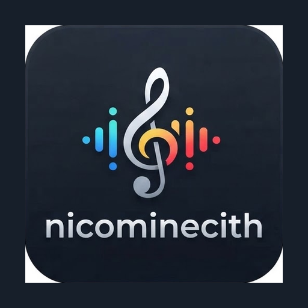

<h1>Nicominecith Musik</h1>

Ein Musik-Client, der Spotify und YouTube Music zu einer Erfahrung verschmilzt

## Was ist Nicominecith Musik?

**Nicominecith Musik** ist ein Android-Musik-Client, der Spotify und YouTube Music kombiniert: Empfehlungen, Suche und Startseite basieren auf dem eigenen Spotify-Account, während die eigentliche Wiedergabe über YouTube Music läuft.

- **Spotify-Personalisierung** – eigene Top-Titel, Lieblingskünstler und Playlists steuern die Empfehlungen
- **YouTube Music-Katalog** – Zugriff auf die riesige YT-Music-Bibliothek zum Streamen
- **Kein Spotify Premium nötig** – es werden nur Spotifys Daten-APIs genutzt, kein Streaming darüber
- **Kein Setup nötig** – einfach mit dem Spotify-Account einloggen, kein eigenes Developer-Dashboard nötig

Dieses Projekt ist ein persönliches Rebrand/Fork auf Basis von [Meld](https://github.com/FrancescoGrazioso/Meld) (selbst ein Fork von [Metrolist](https://github.com/mostafaalagamy/Metrolist)). Alle Rechte an der ursprünglichen Codebasis liegen bei den jeweiligen Original-Autoren; diese Lizenz gilt unverändert weiter (siehe [LICENSE](./LICENSE)).

## APK bauen – ganz ohne PC

Dieses Repo ist so eingerichtet, dass **GitHub Actions** die APK baut. Du brauchst nur einen Browser (z. B. am Handy):

1. Gehe zum **Actions**-Tab dieses Repos.
2. Wähle links den Workflow **„Nicominecith Musik - Debug APK (kein Signing nötig)“**.
3. Tippe auf **„Run workflow“** → **Run workflow** bestätigen.
4. Nach ein paar Minuten erscheint unten im abgeschlossenen Lauf ein Artifact namens **`nicominecith-musik-debug-apk`** – das ist die fertige, installierbare APK zum Herunterladen.

Dieser Workflow läuft außerdem automatisch bei jedem Push auf `main`.

### Weitere Workflows

| Workflow | Zweck | Signing nötig? |
|---|---|---|
| `Nicominecith Musik - Debug APK` | Schnelle Debug-APK zum Testen | Nein |
| `Nicominecith Musik – Quick Test Build` | Release-Build ohne Lint, schnell | Ja (Secrets `KEYSTORE`, `KEY_ALIAS`, `KEYSTORE_PASSWORD`, `KEY_PASSWORD`) |
| `Nicominecith Musik – Build APKs` | Vollständiger Release- + Debug-Build mit Lint | Ja (Release-Teil) |
| `Nicominecith Musik – Release` | Erstellt einen GitHub-Release mit allen Varianten | Ja + `RELEASE_TOKEN` |

Für alle Workflows außer dem Debug-Build müssen die Signing-Secrets im Repo unter **Settings → Secrets and variables → Actions** hinterlegt werden.

## Änderungen in diesem Fork

- App-Name und Application-ID auf `Nicominecith Musik` / `com.nicominecith.musik` umgestellt
- Das `metroproto`-Submodule-Setup war in diesem Repo defekt (kein echter Git-Submodule-Link) und wurde durch einen direkten `git clone` in allen Workflows ersetzt
- Debug-Build benötigt keine Signing-Secrets mehr – nutzt den Standard-Android-Debug-Keystore

## Mitwirken

Issues und Pull Requests sind willkommen. Für größere Änderungen bitte vorher ein Issue eröffnen.

## Lizenz

Dieses Projekt steht wie das Original unter der in [LICENSE](./LICENSE) genannten Lizenz.
